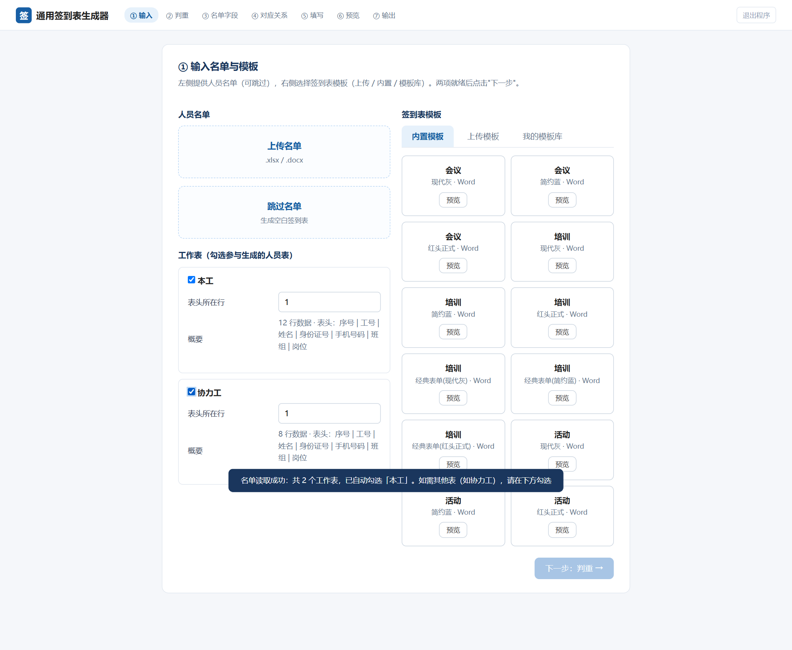
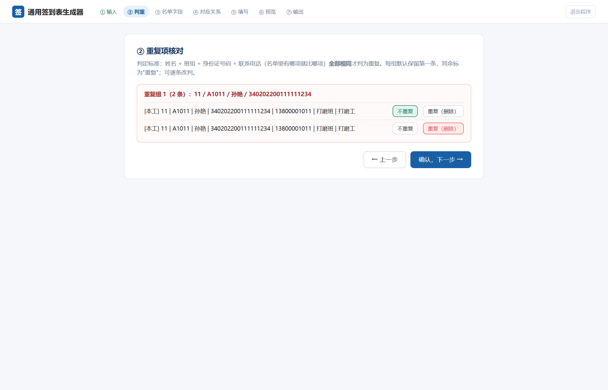
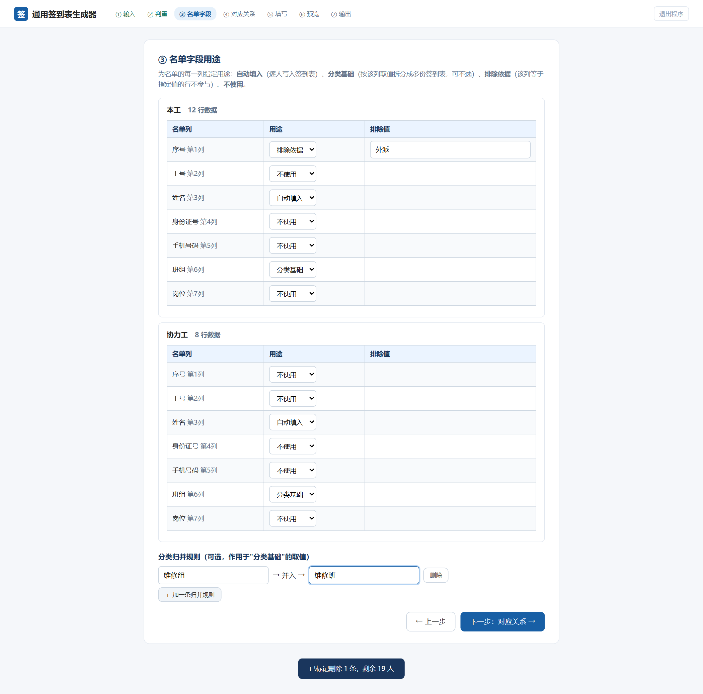
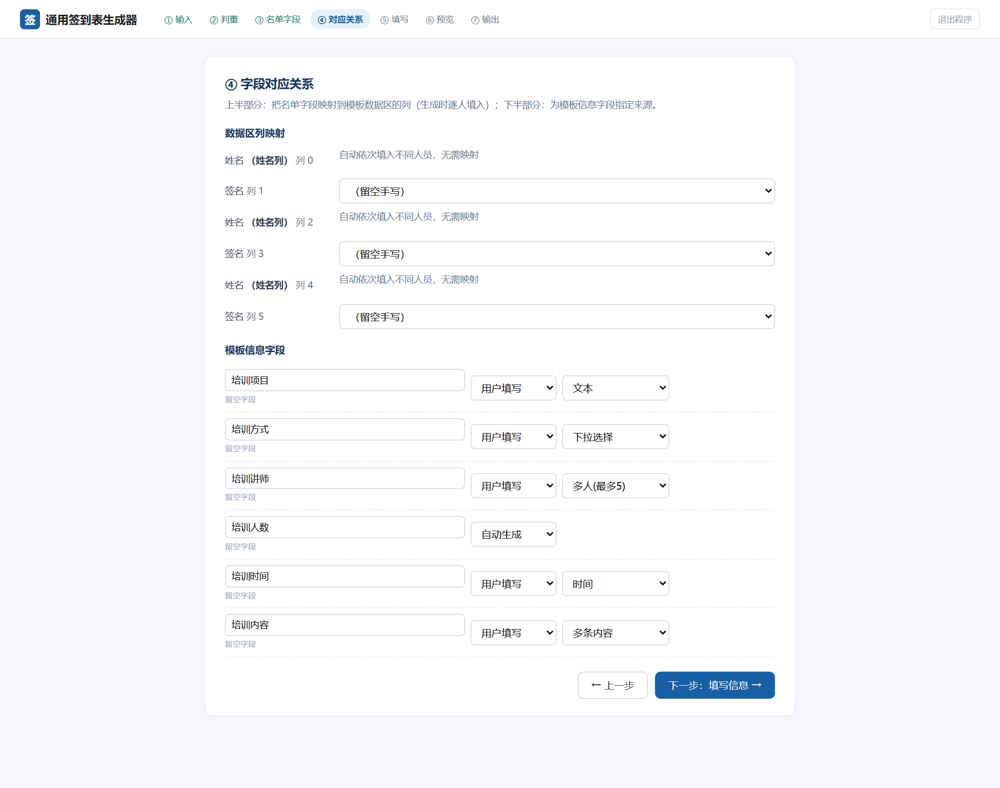
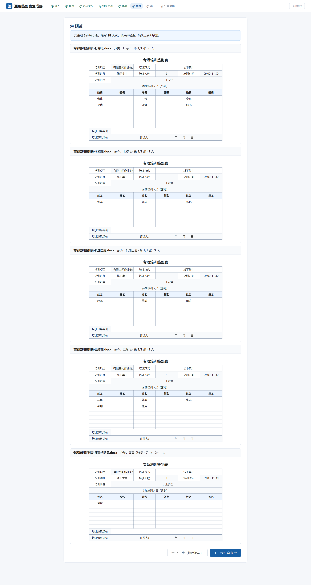

# 通用签到表生成器 · 操作手册

本手册按实际操作顺序逐步截图讲解，示例数据为**脱敏演示名单**（`docs/演示名单-脱敏.xlsx`，虚构人员），您换成自己的名单即可，操作完全一致。

演示场景：某车间安全培训，名单分「本工」「协力工」两个工作表，需要——

- 排除外派人员
- 按班组拆分成多份签到表
- 维修组并入维修班
- 签到表上填培训项目、讲师等信息，签名栏留空手写

---

## 〇、启动程序

双击 `通用签到表生成器.exe`，程序在本机启动（默认地址 `127.0.0.1:17877`）并自动打开内嵌窗口。**关闭窗口即退出程序**，也可以点右上角「退出程序」。

---

## 第 ① 步：输入名单与模板

1. 左侧「人员名单」点击 **上传名单**，选择名单文件（.xlsx 或 .docx）。
2. 上传后程序列出文件里的所有工作表。**默认只勾选第一张有数据的表**，需要参与的工作表（如「本工」「协力工」）请手动勾选。
3. 每张表可确认「表头所在行」（程序自动识别，一般不用改）。
4. 右侧「签到表模板」三种方式任选其一：
   - **内置模板**：12 个现成模板，点卡片上的「预览」可先看效果；
   - **上传模板**：用自己单位的 Word/Excel 模板；
   - **我的模板库**：之前保存过的模板。
5. 名单和模板都就绪后，点 **下一步：判重 →**。

## 第 ② 步：重复项核对

1. 程序按 **姓名 + 班组 + 身份证号 + 手机号**（名单里有哪项就比哪项）全部相同才判为重复。
2. 每组重复默认保留第一条，其余标记为「重复」；如需保留另一条，可逐条改判。
3. 没有重复就直接点 **确认，下一步 →**。

## 第 ③ 步：名单字段用途（重点）

为名单的每一列指定用途：

| 用途 | 含义 | 本例设置 |
|------|------|---------|
| **自动填入** | 该列逐人写入签到表（至少要有姓名列） | 「姓名」列 |
| **分类基础** | 按该列取值拆分成多份签到表（可不选） | 「班组」列 |
| **排除依据** | 该列等于指定值的行不参与生成 | 「序号」列，排除值填 `外派` |
| **不使用** | 忽略该列 | 工号、身份证号等 |

页面**最底部**是 **分类归并规则**：点「＋ 加一条归并规则」，来源填 `维修组`、目标填 `维修班`，两组人就会合并到同一张「维修班」签到表。这是**可选项**，每次生成前按需添加。

设置完点 **下一步：对应关系 →**。

> 💡 提示：归并规则和排除设置是本次操作内生效的，下次重新生成时需要重新设置。

## 第 ④ 步：字段对应关系

上半部分 **数据区列映射**：

- **姓名列**显示"自动依次填入不同人员，无需映射"——程序自动把不同的人依次填进一行内的多个姓名格；
- **签名列**保持「留空手写」，打印后手写签名；
- 如果模板数据区还有其他空白列（如"工号"栏），可以在这里映射名单字段，逐人填入。

下半部分 **模板信息字段**：为模板识别出的每个字段指定来源：

- **用户填写**：第⑤步手动输入（可指定文本 / 下拉选择 / 多人 / 时间 / 多条内容等控件）；
- **自动生成**：如"培训人数"，按每张表实际人数自动算好；
- **由名单提供**：取该分类第一条记录的值；
- **忽略**：留空手写。

点 **下一步：填写信息 →**。

## 第 ⑤ 步：填写签到信息

按第④步设置的"用户填写"字段生成表单，逐项填写即可：

- 内容类字段可加多条，生成时自动按"一、二、三…"编号；
- 讲师最多 5 人；时间用日期时间选择器；
- **任何一项留空，输出文档对应位置就留白**，供打印后手写。

填完点 **生成并预览 ↗**。

## 第 ⑥ 步：预览

顶部汇总一行关键数字：共几张表、填写多少人、排除了谁、归并了哪几组。下方逐张还原 Word 实际效果（含列宽与合并格），请逐张检查。确认无误点 **下一步：输出 →**。

## 第 ⑦ 步：输出

- 点每张表的「下载」单独下载 Word；
- 或点 **打包下载全部（zip）** 一次拿走；
- 第③步选了"分类基础"时，会出现 **下一步：分类输出 →**。

## 第 ⑧ 步：分类输出

按分类分组列出所有文件（本例：打磨班 6 人、木模班 3 人、机加工班 3 人、**维修班 5 人（维修组已并入）**、质量检验员 1 人）。每个分类可单独打包下载，也可以打包下载全部。

---

## 常见问题

**Q：点按钮"没反应"？**
看页面中部的红色错误提示条（不会自动消失）。最常见原因是程序已退出（页面是残留的旧页面）——重新双击 exe 打开即可。

**Q：怎么彻底退出程序？**
关闭窗口，或点右上角「退出程序」。

**Q：人数超过一张表的容量怎么办？**
程序按模板自动检测单张容量（数据行 × 姓名格数），超员自动拆成"标题-分类(2).docx"等多张，每张都带完整的填写信息。

**Q：培训讲师/培训项目留空会怎样？**
输出文档对应位置留白，打印后手写。

**Q：会改动我的模板吗？**
不会。程序只往格子里填文字，行列数、合并单元格、格式全部保持原样。

**Q：名单是 Word 表格可以吗？**
可以。.docx 里的表格同样支持，操作步骤一致。

**Q：换电脑能用吗？**
能。单个 exe 复制过去就能用（Windows 10 及以上），所有数据只在本机。
